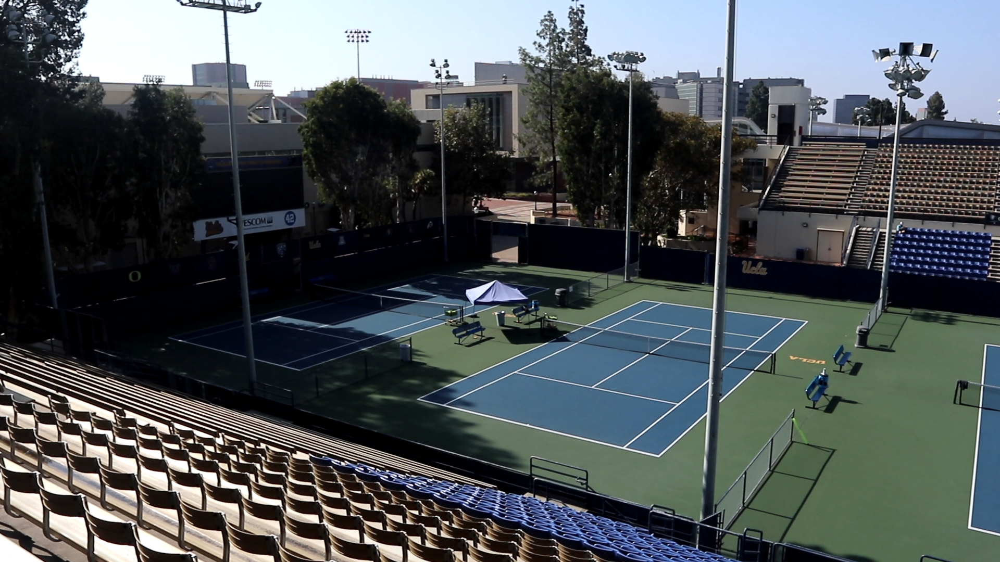

## Implemenation of PSPNet-Keras-tensorflow (https://github.com/Vladkryvoruchko/PSPNet-Keras-tensorflow.git) for RIPS 2018, team Gumgum.

### Modifications

Some modifications are made to the original code as it was seen that the color code was not respected. The `pspnet.py` and `utils.py` are modified such that they follow the correct color code convention found in `utils/color150`.

### Packages compatibility
The installation worked well with the following versions of the packages:
CUDA 9.0, CUDNN 7.0, TENSORFLOW 1.9, KERAS 2.2, GPU 19?, 4 NIVIDA Titan Xp GPUs, no need for CAFFE, PYTHON3.5, ANACONDA,
PIP Version corresponding to Python 3.5

Other dependencies:
    - Tensorflow (-gpu)
    - Keras
    - numpy
    - scipy
    - pycaffe(PSPNet)(optional for converting the weights) 
    ```bash
    pip install -r requirements.txt --upgrade
    ```
\
### Setup
The initial procedure from Vladkryvoruchko/PSPNet-Keras-tensorflow still holds, and it is summarized more detailed below:

1. If caffe is installed and the following is run, then, probably, there is no need to add anything. 
   (compiling the original PSPNet caffe code and pycaffe)

```bash
python weight_converter.py <path to .prototxt> <path to .caffemodel>
```
   
2. If not, the following are needed: <br />
* in `weights/caffe` directory, the `.prototxt` and `.caffemodel` are required for each of the three models 'pspnet50_ade20k', 'pspnet101_cityscapes', 'pspnet101_voc2012':<br />
The `.caffemodel` can be obtained from the PSPNet (https://github.com/hszhao/PSPNet) or from: <br />
pspnet50_ADE20K.caffemodel: https://drive.google.com/open?id=0BzaU285cX7TCN1R3QnUwQ0hoMTA  <br />
pspnet101_VOC2012.caffemodel: https://drive.google.com/open?id=0BzaU285cX7TCNVhETE5vVUdMYk0  <br />
pspnet101_cityscapes.caffemodel: https://drive.google.com/open?id=0BzaU285cX7TCT1M3TmNfNjlUeEU   <br />
The `.prototxt` models can be found under `PSPNet\evaluation\prototxt`.
* Already converted weights (`.json and .h5`) can be downloaded from the following linkds and need to be put into `/weights/keras`
  [pspnet50_ade20k.h5](https://www.dropbox.com/s/0uxn14y26jcui4v/pspnet50_ade20k.h5?dl=1)
[pspnet50_ade20k.json](https://www.dropbox.com/s/v41lvku2lx7lh6m/pspnet50_ade20k.json?dl=1)
  [pspnet101_cityscapes.h5](https://www.dropbox.com/s/c17g94n946tpalb/pspnet101_cityscapes.h5?dl=1)
[pspnet101_cityscapes.json](https://www.dropbox.com/s/fswowe8e3o14tdm/pspnet101_cityscapes.json?dl=1)
  [pspnet101_voc2012.h5](https://www.dropbox.com/s/uvqj2cjo4b9c5wg/pspnet101_voc2012.h5?dl=1)
[pspnet101_voc2012.json](https://www.dropbox.com/s/rr5taqu19f5fuzy/pspnet101_voc2012.json?dl=1)


* The `.npy` that need to go into the `weights/npy` directory can be obtained from:
https://www.dropbox.com/s/ms8afun494dlh1t/pspnet50_ade20k.npy?dl=0
https://www.dropbox.com/s/b21j6hi6qql90l0/pspnet101_cityscapes.npy?dl=0
https://www.dropbox.com/s/xkjmghsbn6sfj9k/pspnet101_voc2012.npy?dl=0

Also, the downloaded trained models (`.caffemodel`) need to be put in `evaluation/model`.

***
### Usage:

```bash
python pspnet.py -m <model> -i <input_image>  -o <output_path>
python pspnet.py -m pspnet101_cityscapes -i example_images/cityscapes.png -o example_results/cityscapes.jpg
python pspnet.py -m pspnet101_voc2012 -i example_images/pascal_voc.jpg -o example_results/pascal_voc.jpg
```
eg:
```python3.5 pspnet.py -m pspnet50_ade20k -i nameofinput.jpg -o nameofoutput.jpg```

List of arguments:
```bash
 -m --model        - which model to use: 'pspnet50_ade20k', 'pspnet101_cityscapes', 'pspnet101_voc2012'
    --id           - (int) GPU Device id. Default 0
 -s --sliding      - Use sliding window
 -f --flip         - Additional prediction of flipped image
 -ms --multi_scale - Predict on multiscale images
```
### Keras results:



### Implementation details
* The interpolation layer is implemented as custom layer "Interp"
* Forward step takes about ~1 sec on single image
* Memory usage can be optimized with:
    ```python
    config = tf.ConfigProto()
    config.gpu_options.per_process_gpu_memory_fraction = 0.3 
    sess = tf.Session(config=config)
    ```
* ```ndimage.zoom``` can take a long time


